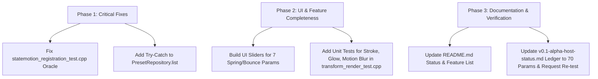

# StateMotion Phase 0.1 Comprehensive Audit Report

**Date:** August 5, 2026  
**Repository:** StateMotion (`e:\motion`)  
**Target Milestone:** v0.1 Private Alpha Candidate  

---

## 1. Executive Summary

A comprehensive code, documentation, and test suite audit was performed across the StateMotion project. StateMotion is an independently developed motion-transition effect and UXP control panel for Adobe Premiere Pro.

While the overall code architecture is exceptionally modular, clean, and well-separated between host-independent math/render engines and Adobe/UXP adapters, the audit uncovered **consequential documentation drift, test suite crashes, missing UI controls, and fragile error handling** that must be resolved before host certification.

---

## 2. Key Findings & Status Discrepancies

### 2.1 Stale Documentation vs. Actual Code & Commit History

* **Finding:** The root [README.md](file:///e:/motion/README.md#L26-L35) claims that several key features are **"Not currently implemented"**:
  * Crop and rounded masks
  * Stroke, glow, and shadow
  * Motion blur
* **Actual Reality:**
  * **Crop & Corner Radius:** Fully implemented in [transform_render.cpp](file:///e:/motion/src/statemotion/renderer/transform_render.cpp) using SDF rounded rectangle masking, verified by AC9 and AC10 tests in [transform_render_test.cpp](file:///e:/motion/src/statemotion/renderer/transform_render_test.cpp#L238-L275).
  * **Drop Shadow:** Fully implemented in [transform_render.cpp](file:///e:/motion/src/statemotion/renderer/transform_render.cpp) via Porter-Duff alpha compositing, verified by AC11 tests in [transform_render_test.cpp](file:///e:/motion/src/statemotion/renderer/transform_render_test.cpp#L277-L297).
  * **Stroke & Glow:** Defined in [transform_render.h](file:///e:/motion/src/statemotion/renderer/transform_render.h#L50-L59), rasterized in `transform_render.cpp`, and read/interpolated per-parameter in native Adobe effect rendering [statemotion_effect.cpp](file:///e:/motion/src/statemotion/adobe/statemotion_effect.cpp#L345-L362).
  * **Motion Blur:** Multi-sample accumulation loop implemented in [statemotion_effect.cpp](file:///e:/motion/src/statemotion/adobe/statemotion_effect.cpp#L365-L370) and lines 453–533.
  * **Commit History:** Merge commits explicitly document these additions (`Implement Motion Blur`, `Implement Spring and Bounce Easing`, `feat: implement stroke and glow in renderer and UXP panel`, `feat(native): wire crop, shadow, and spring/bounce into Premiere Render() path`).

### 2.2 Test Coverage Gaps (Stroke, Glow, Motion Blur)

* **Finding:** In [transform_render_test.cpp](file:///e:/motion/src/statemotion/renderer/transform_render_test.cpp), test assertions exist for AC1–AC11 (Identity, Translation, Scale, Rotation, Opacity, Off-screen, Premultiplied compositing, SafeScale, Degenerate scale, Overshoot, Rerender determinism, Monotonic easing, Crop, Corner radius, Drop shadow).
* **Gap:** **Stroke, Glow, and Motion Blur have ZERO dedicated unit test cases** (AC12/AC13/AC14 are missing).
* **Impact:** Regressions in stroke gradient phase, glow radius calculation, or motion blur temporal sample offsets could occur undetected during refactoring.

### 2.3 C++ Test Suite Segfault (Buffer Overflow)

* **Location:** [statemotion_registration_test.cpp](file:///e:/motion/src/statemotion/adobe/statemotion_registration_test.cpp#L29-L55)
* **Root Cause:** The test oracle array `kExpected` is hardcoded with 25 elements. However, [parameter_ids.hpp](file:///e:/motion/shared/generated/parameter_ids.hpp#L36) was updated to 70 parameters (`kParameterCount = 70`, Binding Revision 4).
* **Failure Mechanism:** The test loop `for (int i = 0; i < n; ++i)` (where `n` = 70) reads `kExpected[i]`, causing a global buffer overflow out-of-bounds access on indices 25–69 and crashing with a segfault under AddressSanitizer.

### 2.4 Missing Spring / Bounce UI Controls & Shared Fixture Coverage

* **Location:** [inspector.ts](file:///e:/motion/src/statemotion/panel/src/ui/inspector.ts#L184-L193)
* **Issue:** While Spring and Bounce easing math are fully implemented in both C++ and TypeScript, the UXP panel inspector renders only static placeholder labels (`"Spring Settings..."` and `"Bounce Settings..."`).
* **Impact:** Users cannot modify the 7 spring/bounce parameters (`transition.springFrequency`, `transition.springDamping`, `transition.springInitialVelocity`, `transition.bounceCount`, `transition.bounceHeightDecay`, `transition.bounceTimeDecay`, `transition.bounceHangTime`) through the panel UI. Additionally, spring/bounce lack shared parity fixture validation across C++ and TS.

### 2.5 Unhandled Error Vulnerability in Preset Loading

* **Location:** [presetStorage.ts](file:///e:/motion/src/statemotion/panel/src/domain/presetStorage.ts#L99-L110) (`PresetRepository.list()`)
* **Issue:** `list()` loops through files in `bundled` and `user` directories and calls `deserializePreset(await this.fs.readFile(f))` without wrapping per-file reads in a `try...catch` block.
* **Impact:** A single corrupted or malformed `.stmpreset` file in the user's directory will throw an unhandled exception, causing `list()` to fail completely and blanking out the panel preset view.

### 2.6 Native Render Status & Host Status Ledger Debt

* **Location:** [v0.1-alpha-host-status.md](file:///e:/motion/docs/releases/v0.1-alpha-host-status.md#L206-L210)
* **Issue:** The ledger records a critical native-render low-level exception (`AEVideoFilter:11`) that occurred during live Premiere Pro testing. The issue was root-caused (8-bit host world misread as 16-byte float pixels) and fixed via `statemotion_world_pixels.hpp`.
* **Debt:** The ledger remains stuck at **"awaiting operator re-test"**, and parameter count in the contract documentation section (line 38) still says 43 instead of 70. Real Premiere Pro 2026 verification remains pending.

---

## 3. Component Verification Summary

| Component | Status | Details |
|---|---|---|
| **TypeScript Panel** | ✅ SOLID | Clean typecheck, 24/24 test suites pass, `npm run build` succeeds |
| **C++ Progress Engine** | ✅ SOLID | Evaluators and easing math build and pass |
| **C++ World Pixels Adapter** | ✅ SOLID | 12/12 SDK-free C++ test cases pass |
| **C++ Renderer Suite** | ⚠️ GAPS | Passes AC1–AC11; missing stroke, glow, and motion blur test cases |
| **C++ Registration Suite** | ❌ FAILING | Segfaults due to 25 vs 70 parameter count mismatch in oracle array |
| **UXP Inspector UI** | ⚠️ INCOMPLETE | Spring & Bounce controls stubbed out as static text labels |
| **Preset Storage** | ⚠️ FRAGILE | Missing per-file exception handling in `PresetRepository.list()` |
| **Documentation** | ❌ DRIFTED | README undersells built features; host status ledger outdated |

---

## 4. Prioritized Fix Plan

### Phase 1: Critical Stability & Test Fixes (Immediate)

1. **Fix `statemotion_registration_test.cpp` Segfault:**
   * Update `kExpected` array and assertions to match the current 70-parameter contract in `parameter_ids.hpp`.
2. **Add Per-File Resilience in `PresetRepository.list()`:**
   * Wrap individual file deserialization in `try...catch`. Log/skip malformed preset files so valid presets still load cleanly.

### Phase 2: UI Completeness & Test Coverage Expansion

3. **Implement Spring/Bounce UI Controls in `inspector.ts`:**
   * Replace placeholder rows with interactive number inputs/sliders for all 7 spring and bounce parameters.
4. **Add Unit Tests for Stroke, Glow, and Motion Blur:**
   * Add AC12 (Stroke rendering & gradient phase), AC13 (Glow intensity & radius), and AC14 (Motion blur shutter angle multi-sampling) to `transform_render_test.cpp`.

### Phase 3: Documentation Sync & Host Certification

5. **Update `README.md` Status:**
   * Move Crop, Corner Radius, Drop Shadow, Stroke, Glow, and Motion Blur from "Not currently implemented" to "Currently implemented".
6. **Update Host Status Ledger (`v0.1-alpha-host-status.md`):**
   * Sync parameter count from 43 to 70.
   * Document native render fix status and set up operator re-test checklist for Premiere Pro 2026.

---
*Report generated automatically during StateMotion code audit.*
